# AI RAG Document Assistant

A containerized, multi-document Retrieval-Augmented Generation (RAG) platform built with **Python, FastAPI, Docling, Sentence Transformers, ChromaDB, CrossEncoder reranking, Ollama, Redis, PostgreSQL, RQ, Ragas, Prometheus, Grafana, and Docker Compose**.

The system allows users to upload multiple documents, retrieve relevant information across their uploaded documents, generate answers using a local LLM, cache responses, persist application data, and asynchronously evaluate generated answers for **Faithfulness** using Ragas.

---

## Architecture

```text
                         ┌─────────────────────┐
                         │      Frontend       │
                         │   Document Upload   │
                         │    Ask Questions    │
                         └──────────┬──────────┘
                                    │
                                    ▼
                         ┌─────────────────────┐
                         │      FastAPI        │
                         │      Backend        │
                         └──────────┬──────────┘
                                    │
                    ┌───────────────┼────────────────┐
                    │               │                │
                    ▼               ▼                ▼
              ┌──────────┐   ┌────────────┐   ┌────────────┐
              │  Redis   │   │ PostgreSQL │   │ RAG Pipeline│
              │  Cache   │   │ Persistence│   │            │
              └──────────┘   └────────────┘   └──────┬─────┘
                                                      │
                                                      ▼
                                           ┌──────────────────┐
                                           │    Retrieval     │
                                           │    ChromaDB      │
                                           └────────┬─────────┘
                                                    │
                                                    ▼
                                           ┌──────────────────┐
                                           │ CrossEncoder     │
                                           │    Reranker      │
                                           └────────┬─────────┘
                                                    │
                                                    ▼
                                           ┌──────────────────┐
                                           │ Context Builder  │
                                           └────────┬─────────┘
                                                    │
                                                    ▼
                                           ┌──────────────────┐
                                           │ Ollama / Qwen    │
                                           │ Local LLM        │
                                           └────────┬─────────┘
                                                    │
                                                    ▼
                                                 Answer
                                                    │
                         ┌──────────────────────────┼──────────────────────┐
                         │                          │                      │
                         ▼                          ▼                      ▼
                    Redis Cache               PostgreSQL              RQ Queue
                                                                           │
                                                                           ▼
                                                                     Ragas Worker
                                                                           │
                                                                           ▼
                                                                  Faithfulness Score
                                                                           │
                                                                           ▼
                                                                     PostgreSQL


                         Observability
                              │
                              ▼
                     ┌──────────────────┐
                     │    Prometheus    │
                     │ Metrics Collection│
                     └────────┬─────────┘
                              │
                              ▼
                     ┌──────────────────┐
                     │     Grafana      │
                     │    Dashboards    │
                     └──────────────────┘
```

---

# What This Project Does

The platform implements an end-to-end RAG workflow:

1. User uploads a document.
2. The document is parsed using **Docling**.
3. Parsed content is cleaned and chunked.
4. Chunks are converted into embeddings using **Sentence Transformers**.
5. Embeddings are stored in **ChromaDB**.
6. Document metadata and application information are persisted in **PostgreSQL**.
7. Uploaded documents are associated with a user session using **Redis**.
8. User asks a question.
9. Relevant chunks are retrieved from ChromaDB.
10. The initial retrieval returns the top **10** candidates.
11. Retrieved chunks are reranked using a **CrossEncoder**.
12. The top **4** reranked chunks are selected.
13. The selected chunks are assembled into the LLM context.
14. **Ollama with Qwen3 1.7B** generates the answer locally.
15. The generated answer is cached in Redis.
16. The question and conversation messages are persisted in PostgreSQL.
17. A Ragas evaluation job is placed into an **RQ/Redis queue**.
18. A background worker evaluates the response for **Faithfulness**.
19. The evaluation result is stored in PostgreSQL.
20. Prometheus collects application and RAG metrics.
21. Grafana provides dashboards for monitoring the system.

---

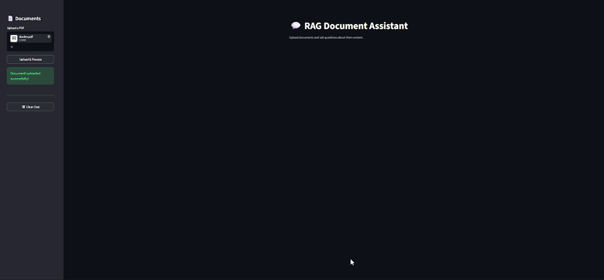

# RAG Pipeline

## 1. Document Ingestion

The ingestion pipeline starts when a user uploads a document.

```text
Document
   │
   ▼
Docling Parser
   │
   ▼
Parsed Content
   │
   ▼
Cleaning / Processing
   │
   ▼
Chunking
   │
   ▼
Sentence Transformer
   │
   ▼
Embeddings
   │
   ▼
ChromaDB
```

The project processes document content before storing it in the vector database.

The project keeps separate processing stages for:

* Parsed documents
* Chunked documents
* Generated embeddings
* Vector storage

Generated local processing artifacts are intentionally excluded from the Git repository.

---

# 2. Document Parsing

**Docling** is used as part of the document ingestion pipeline to parse uploaded documents and extract their content into a structure that can be processed by the RAG system.

The parsed content is then passed to the chunking stage.

---

# 3. Chunking

The extracted document content is divided into smaller chunks before embedding.

Chunking allows the retrieval system to search smaller sections of the original document instead of passing entire documents to the LLM.

The chunks retain document-related metadata such as page information where available.

---

# 4. Embeddings

The project uses:

```text
Sentence Transformer:
all-MiniLM-L6-v2
```

Each document chunk is converted into a vector representation.

These vectors are used for semantic similarity search.

---

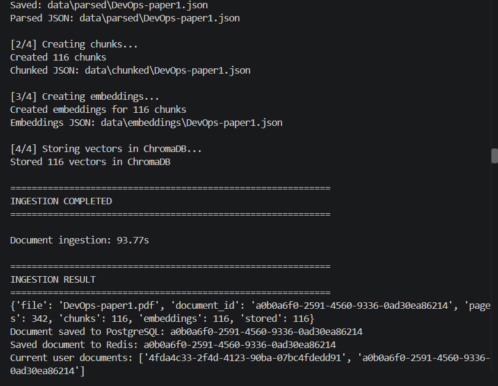

# 5. Vector Database

The project uses **ChromaDB** for vector storage and retrieval.

During a question:

```text
Question
   │
   ▼
Embedding
   │
   ▼
ChromaDB
   │
   ▼
Top 10 candidate chunks
```

The retrieval stage initially selects:

```text
RETRIEVE_TOP_K = 10
```

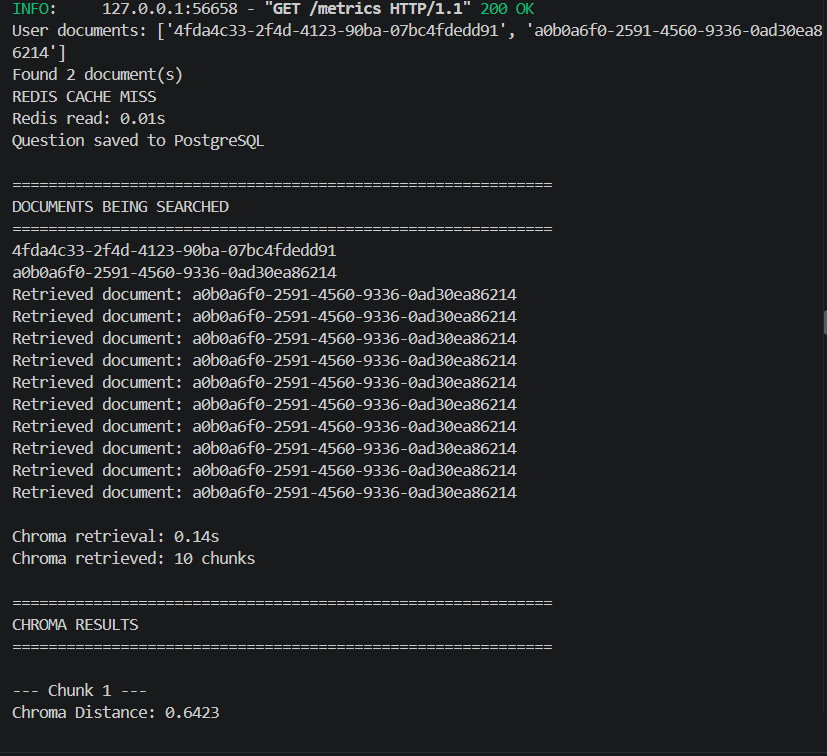

---

# 6. CrossEncoder Reranking

The initial ChromaDB results are not directly sent to the LLM.

The retrieved candidates are passed through a **CrossEncoder reranker**.

```text
ChromaDB
   │
   │ Top 10
   ▼
CrossEncoder
   │
   │ Reranking
   ▼
Top 4 chunks
```

The final context is built from the highest-ranked chunks.

The project uses:

```text
FINAL_TOP_K = 4
```

This provides a second-stage relevance filtering step before generation.

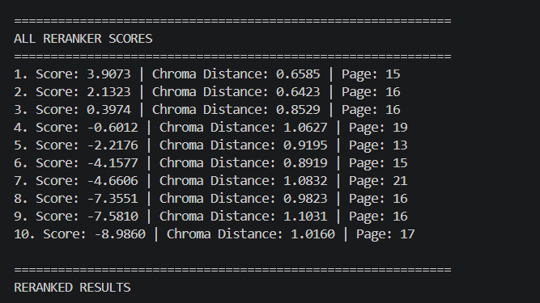

---

# 7. Context Construction

The reranked chunks are combined into the context supplied to the generation model.

The pipeline therefore becomes:

```text
Question
   ↓
ChromaDB Retrieval
   ↓
Top 10
   ↓
CrossEncoder Reranking
   ↓
Top 4
   ↓
Context
   ↓
LLM
```

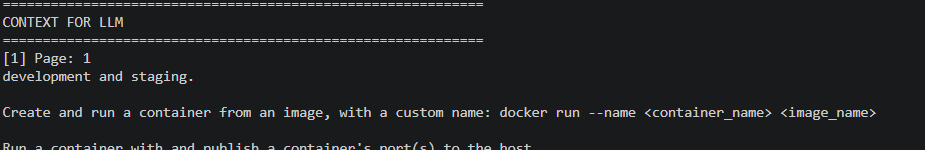

---

# 8. Local LLM Generation

The project uses **Ollama** to run the generation model locally.

Current generation model:

```text
Qwen3 1.7B
```

The model receives:

* User question
* Retrieved context

and generates the final answer.

The LLM runs locally rather than requiring an external hosted LLM API.

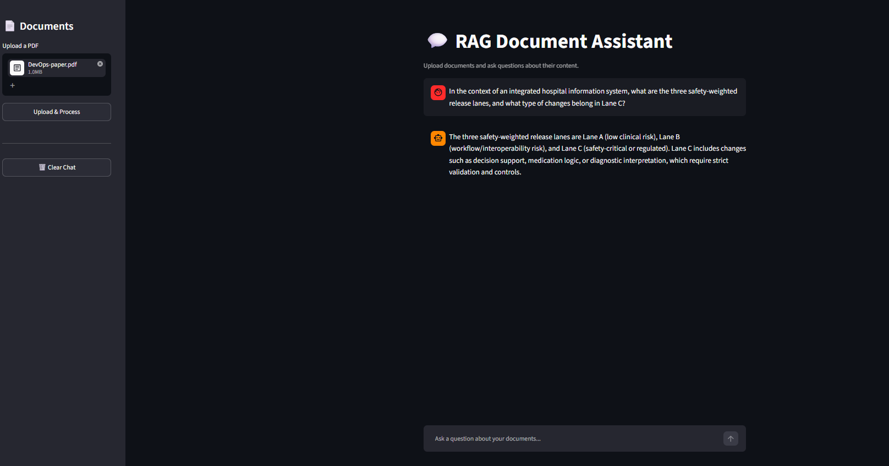

---

# Redis

Redis is used for multiple application-level operations.

## Document Association

Redis stores the documents associated with a user session.

```text
user:{session_id}:documents
```

This allows the application to determine which documents belong to a particular session.

## Answer Caching

Generated answers are cached in Redis.

The `/ask` flow checks Redis before running the RAG pipeline.

```text
Question
   │
   ▼
Redis
   │
   ├── Cached answer → Return answer
   │
   └── Cache miss
          │
          ▼
       RAG Pipeline
          │
          ▼
       New Answer
          │
          ▼
       Redis Cache
```

Redis is therefore used to avoid unnecessarily repeating the RAG generation process for previously answered questions.

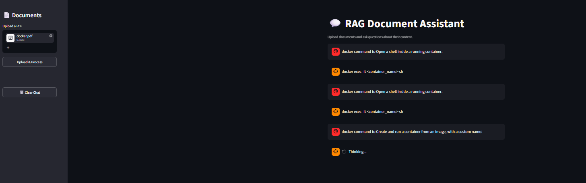

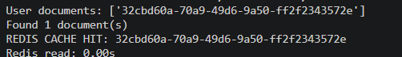

## Chat History

Redis is also used to maintain chat history for the application session.

---

# PostgreSQL

PostgreSQL provides persistent storage for application data.

The project stores information including:

### Documents

Document records contain information such as:

* Document ID
* Session ID
* Filename
* Processing status

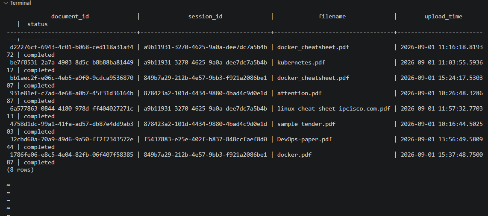

### Questions

Questions submitted through the RAG application are persisted.

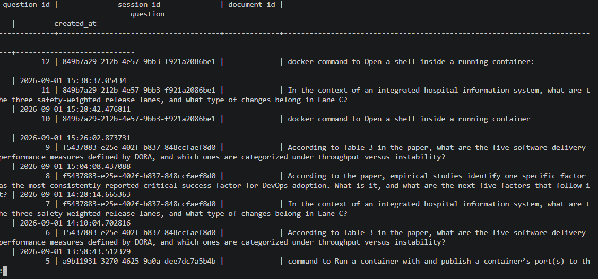

### Evaluations

Ragas evaluation results are stored in PostgreSQL.

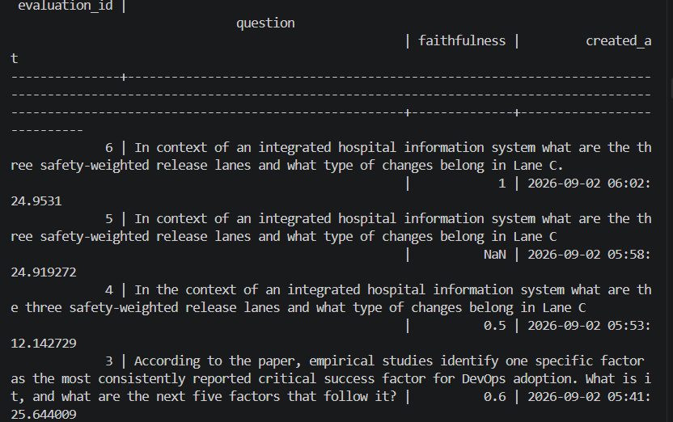

---

# Asynchronous RAG Evaluation

Ragas evaluation is deliberately separated from the synchronous `/ask` request.

The application does not make the user wait for the Ragas evaluation to finish.

```text
                  /ask
                   │
                   ▼
              RAG Pipeline
                   │
                   ▼
                Answer
                   │
                   ├──────────────► User
                   │
                   ▼
              RQ Queue
                   │
                   ▼
             Ragas Worker
                   │
                   ▼
          Faithfulness Evaluation
                   │
                   ▼
              PostgreSQL
```

This was implemented using:

* Redis
* RQ
* RQ Worker
* Ragas

---

# Ragas

The project currently evaluates generated responses using the **Faithfulness** metric.

The evaluation uses the same local Ollama-based Qwen model as the evaluator:

```text
Ollama
   │
   ▼
Qwen3 1.7B
   │
   ▼
Ragas
   │
   ▼
Faithfulness
```

The evaluation receives:

```text
Question
Retrieved Context
Generated Answer
```

The resulting Faithfulness score is persisted to PostgreSQL.

The evaluation runs asynchronously through the RQ worker.

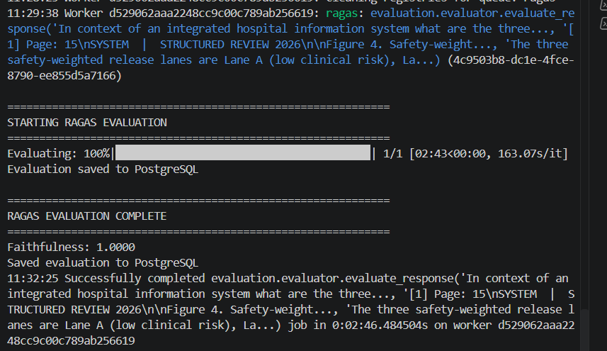

---

# Background Worker

The Ragas evaluation worker runs independently from the FastAPI application.

Worker startup:

```bash
python -m evaluation.worker
```

The worker listens to the RQ queue and processes evaluation jobs in the background.

This prevents the relatively expensive local LLM-based evaluation from blocking the `/ask` API response.

---

# API

The FastAPI application exposes endpoints including:

### Health Check

```http
GET /health
```

Used to verify that the API is running.

### Upload Document

```http
POST /upload
```

Uploads and ingests a document for a session.

### Get Session Documents

```http
GET /documents/{session_id}
```

Returns documents associated with a session.

### Ask Question

```http
POST /ask
```

Runs the RAG pipeline and returns the generated answer.

### Chat History

```http
GET /chat-history
```

Returns the stored conversation history.

### Prometheus Metrics

```http
GET /metrics
```

Exposes application metrics for Prometheus.

---

# Observability

Observability was implemented using:

```text
FastAPI
   │
   ▼
Prometheus Metrics
   │
   ▼
Prometheus
   │
   ▼
Grafana
```

The FastAPI application exposes metrics using the Prometheus FastAPI instrumentator and custom Prometheus metrics.

---

# Custom Metrics

The project tracks metrics around important parts of the RAG system.

### Document Ingestion Latency

```text
document_ingestion_seconds
```

Measures the time required to ingest a document.

### Cache Latency

```text
cache_latency_seconds
```

Measures Redis cache operation latency.

### RAG Pipeline Latency

```text
rag_latency_seconds
```

Measures total RAG pipeline execution time.

### RAG Requests

```text
rag_requests_total
```

Counts `/ask` requests.

### RAG Failures

```text
rag_failures_total
```

Tracks RAG pipeline failures.

### Retrieval Latency

```text
rag_retrieval_seconds
```

Measures the time spent retrieving relevant chunks.

### LLM Latency

```text
rag_llm_seconds
```

Measures the time taken by the LLM to generate an answer.

### LLM Failures

```text
rag_llm_failures_total
```

Tracks LLM generation failures.

The application also exposes standard HTTP metrics through the Prometheus FastAPI instrumentator.

---

# Grafana Dashboard

Grafana is used to visualize the collected Prometheus metrics.

The dashboard covers areas including:

* Application metrics
* RAG metrics
* Retrieval latency
* LLM latency
* Ingestion latency
* Cache latency
* Request activity
* Failure metrics

Example dashboard screenshots are included in the repository.

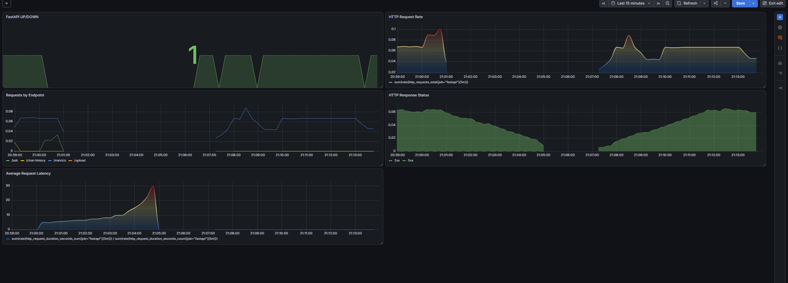

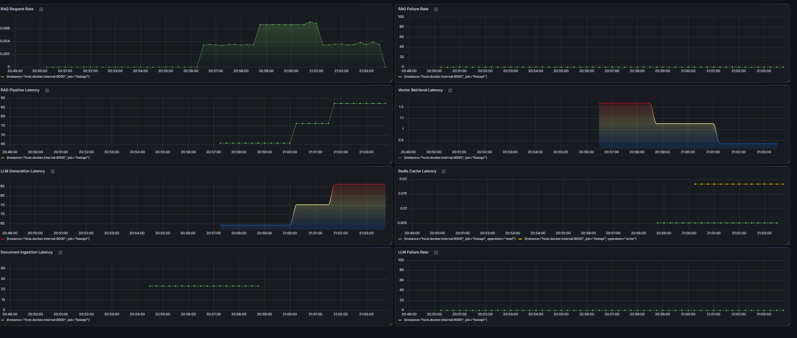

---

# Docker Architecture

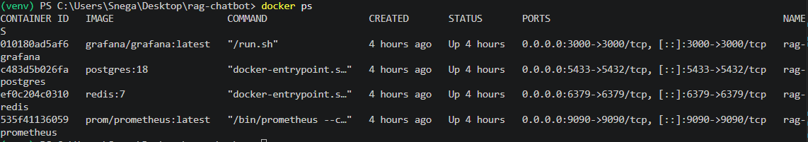

The project uses Docker Compose to run the supporting infrastructure.

The main infrastructure components include:

```text
Docker Compose
├── PostgreSQL
├── Redis
├── Prometheus
└── Grafana


```

Ollama runs locally and provides the LLM inference service.

The RQ worker runs separately from the API process so that background Ragas evaluations can be processed independently.

---

# Request Flow

A typical question follows this flow:

```text
User
 │
 ▼
FastAPI /ask
 │
 ▼
Get user's document IDs from Redis
 │
 ▼
Check Redis cache
 │
 ├── Cache Hit
 │      │
 │      └── Return cached answer
 │
 └── Cache Miss
        │
        ▼
   Save question
        │
        ▼
   ChromaDB Retrieval
        │
        ▼
   Top 10 chunks
        │
        ▼
   CrossEncoder Reranking
        │
        ▼
   Top 4 chunks
        │
        ▼
   Build Context
        │
        ▼
   Ollama / Qwen3 1.7B
        │
        ▼
   Generated Answer
        │
        ├──────────────► Redis Cache
        │
        ├──────────────► PostgreSQL
        │
        └──────────────► RQ Queue
                              │
                              ▼
                         Ragas Worker
                              │
                              ▼
                         Faithfulness
                              │
                              ▼
                         PostgreSQL
```

---

# Document Ingestion Flow

```text
PDF / DOCX / CSV
       │
       ▼
    Docling
       │
       ▼
Parsed Document
       │
       ▼
    Chunking
       │
       ▼
Sentence Transformer
all-MiniLM-L6-v2
       │
       ▼
   Embeddings
       │
       ▼
    ChromaDB
```

---

# Technology Stack

| Area             | Technology              |
| ---------------- | ----------------------- |
| Language         | Python                  |
| API              | FastAPI                 |
| Document Parsing | Docling                 |
| Embeddings       | Sentence Transformers   |
| Embedding Model  | `all-MiniLM-L6-v2`      |
| Vector Database  | ChromaDB                |
| Reranking        | CrossEncoder            |
| LLM Runtime      | Ollama                  |
| Generation Model | Qwen3 1.7B              |
| Cache            | Redis                   |
| Database         | PostgreSQL              |
| Background Jobs  | RQ                      |
| RAG Evaluation   | Ragas                   |
| Metrics          | Prometheus              |
| Dashboards       | Grafana                 |
| Containerization | Docker / Docker Compose |
